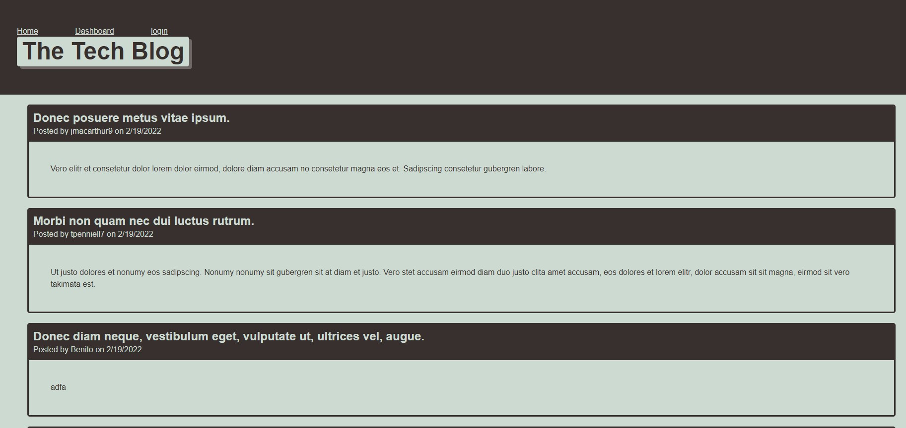

# tech-blog

 

## Purpose
CMS-style blog site where developers can publish their blog posts and comment on other developers’ posts as well.

## Built with
* Javascript
* NPM Packages 
  * mysql2
  * sequelize
  * dotenv 
  * express-session
  * connect-session-sequilize

## Application

We use insomnia application to test the different GET, Post, Put and Delete Routes.

## GitHub Repository

https://github.com/Benitocr/tech-blog

## Contribution
2022  by [Benito Cavazos](https://github.com/Benitocr)